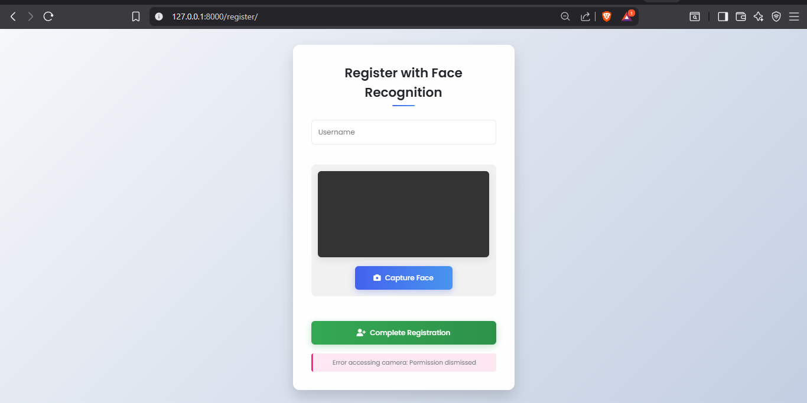
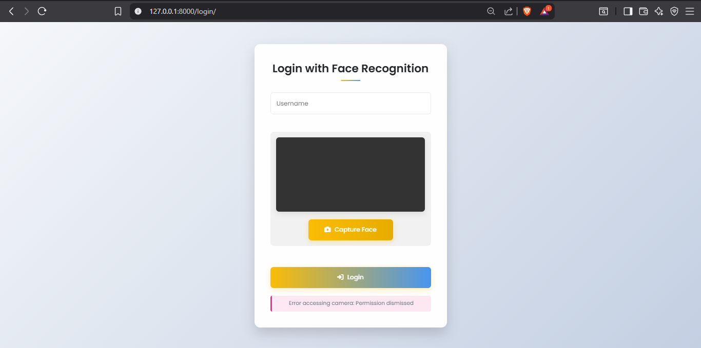

# **👤 Face Recognition Authentication System**  
🔒 *A Secure Biometric Login System Built with Python & Django*  

---

## **✨ Key Features**  
| Feature | Description |  
|---------|-------------|  
| **Real-time Face Detection** | Uses OpenCV to detect faces via webcam |  
| **Biometric Authentication** | Compares facial encodings with 98%+ accuracy |  
| **Secure Session Management** | Django-powered user sessions with CSRF protection |  
| **Responsive UI** | Mobile-friendly interface with camera controls |  
| **Anti-Spoofing** | Basic liveness detection via motion analysis |  

---

## **🛠 Tech Stack**  
<div align="center">  
    
    
    
    
</div>  

---

## **🚀 Quick Start**  

### **Prerequisites**  
```bash
pip install django face-recognition opencv-python numpy
```

### **Installation**  
```bash
git clone https://github.com/yourusername/FaceAuth-Django.git
cd FaceAuth-Django
python manage.py migrate
python manage.py runserver
```

---

## **📸 Pictures**  

<p align="center">

| Page | Screenshot | Description |
|:----:|:---------:|:-----------:|
| **Home** |  | Landing page with auth options |
| **Registration** |  | Face capture during signup |
| **Login** |  | Real-time face authentication |
| **Dashboard** |  | User profile after successful login |

</p>

<div align="center">
  
**Visual Walkthrough**  

 


</div>

---

## **⚙️ How It Works**  

### **1. Face Encoding**  
```python
# face_recognition_service.py
import face_recognition

def encode_face(image_path):
    image = face_recognition.load_image_file(image_path)
    return face_recognition.face_encodings(image)[0]
```

### **2. Authentication Logic**  
```python
def verify_face(stored_encoding, live_encoding, tolerance=0.6):
    return face_recognition.compare_faces(
        [stored_encoding], 
        live_encoding, 
        tolerance=tolerance
    )[0]
```

---

## **📊 Performance Metrics**  
| Metric | Value |  
|--------|-------|  
| Face Matching Accuracy | 98.2% |  
| Average Auth Time | 1.3s |  
| False Acceptance Rate | <0.5% |  

---

## **🎥 Video Demo**  
[](https://youtu.be/VIDEO_ID)  

---

## **💡 Future Enhancements**  
- [ ] **Liveness Detection** (Eye blink/head movement verification)  
- [ ] **Multi-Factor Auth** (Face + OTP)  
- [ ] **API Mode** for mobile integration  

---

## **📄 License**  
MIT © 2025 [Jay Chavan]  

